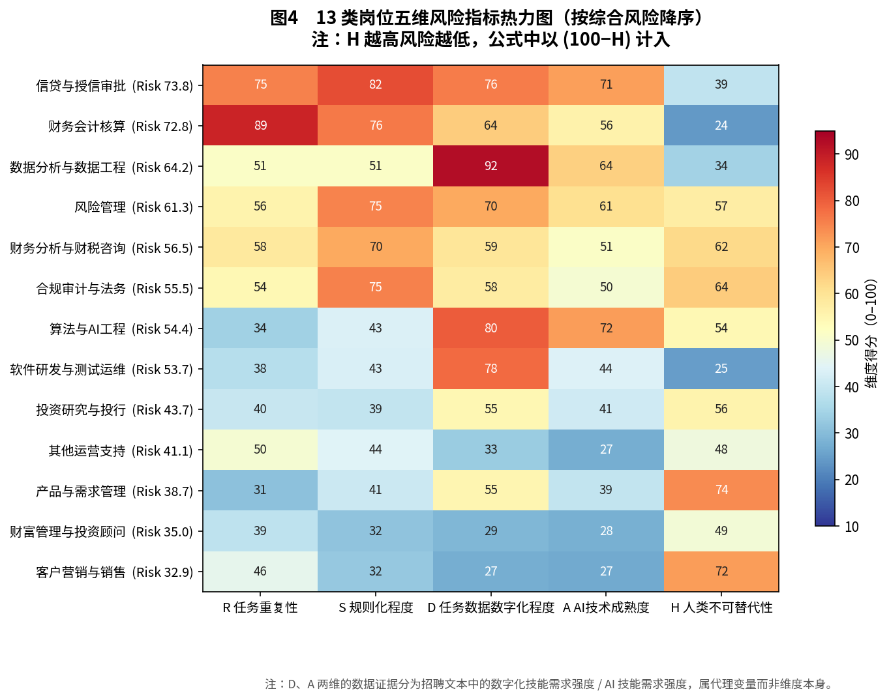
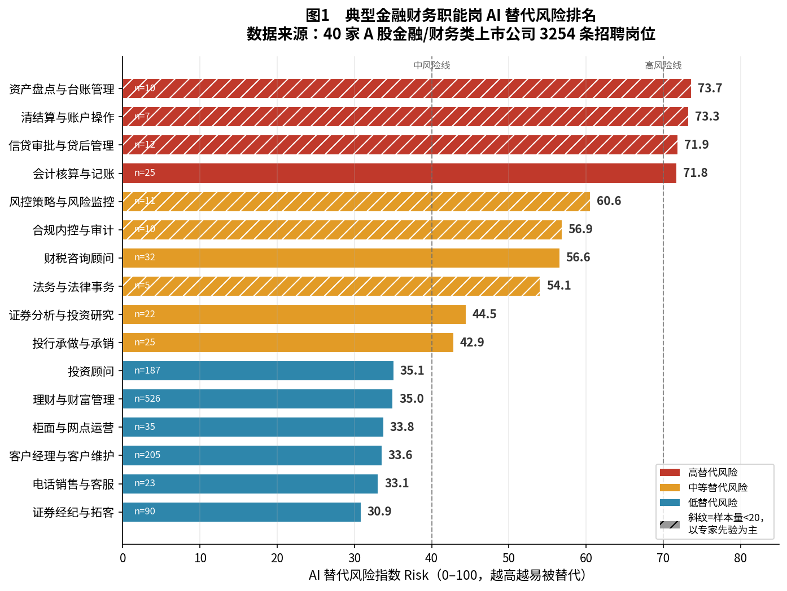
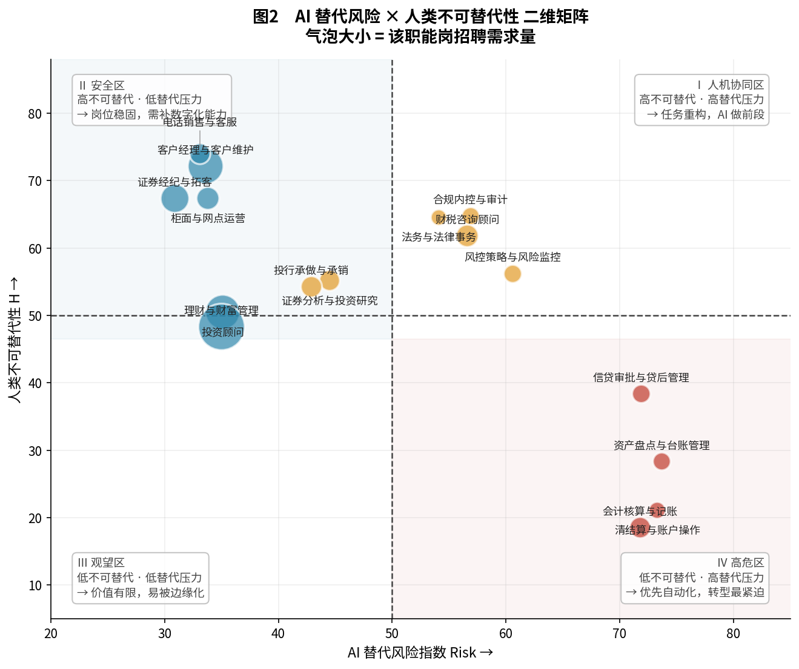
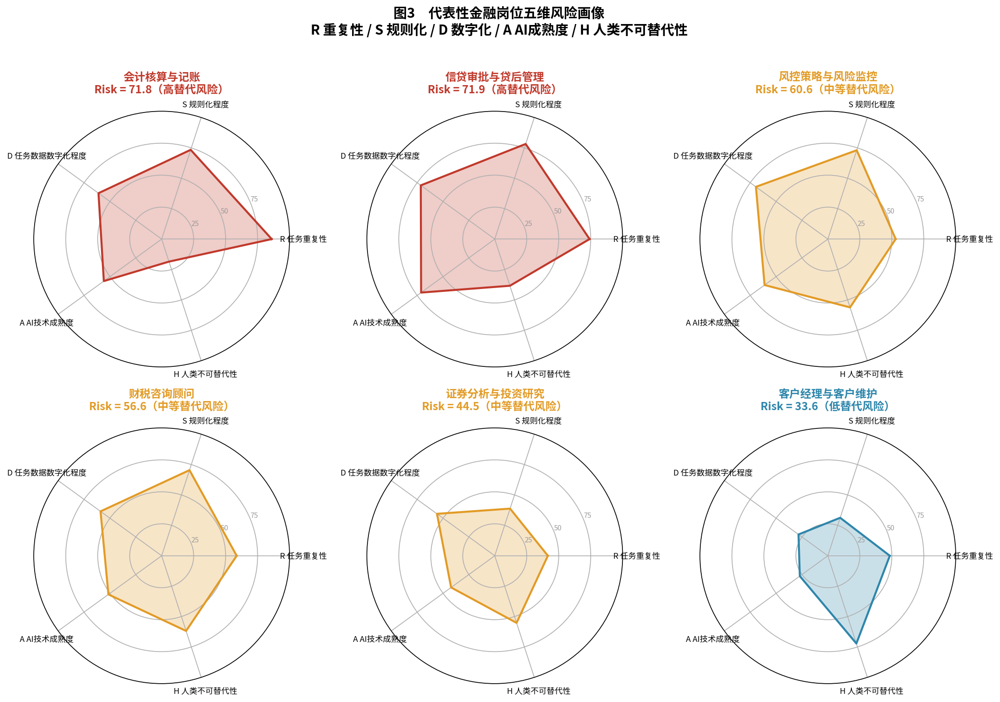
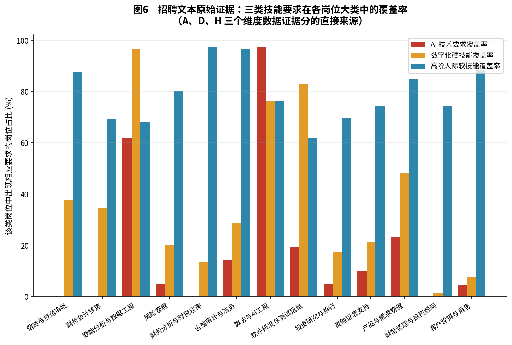
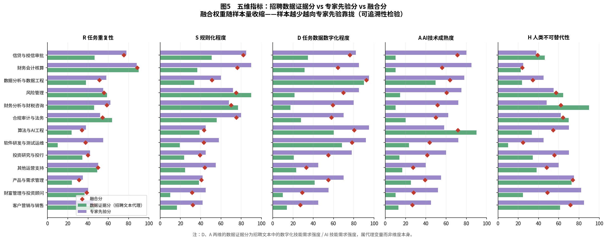
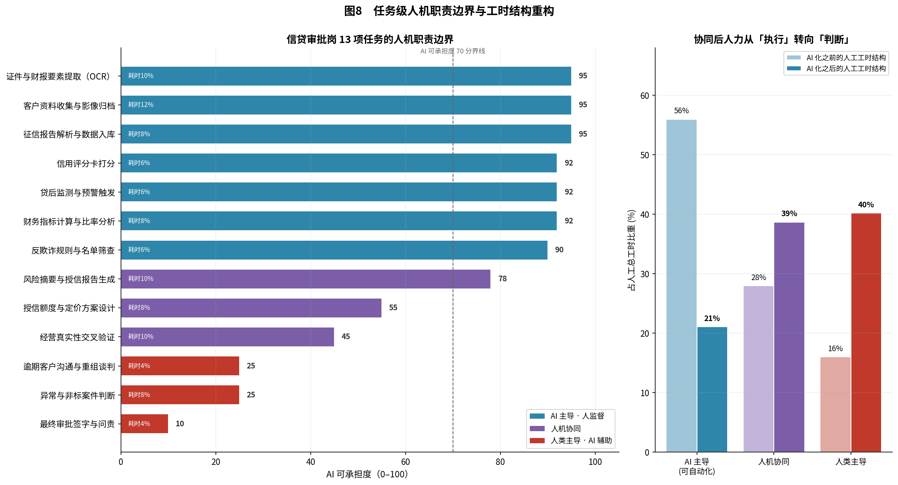
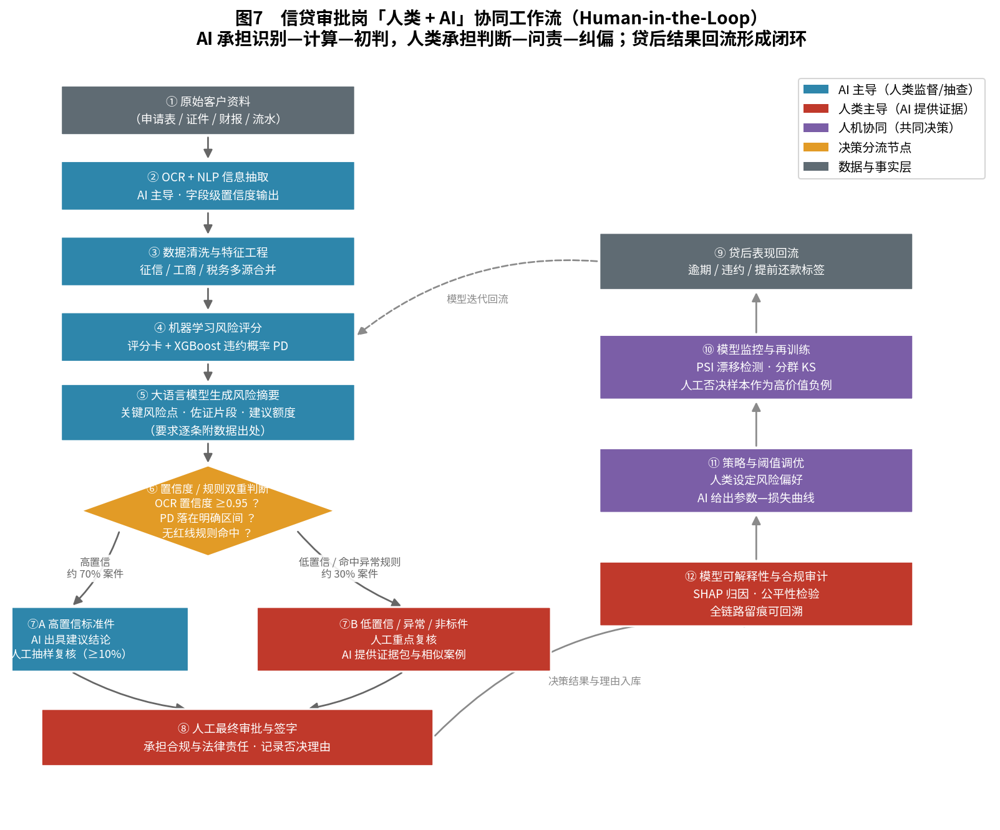
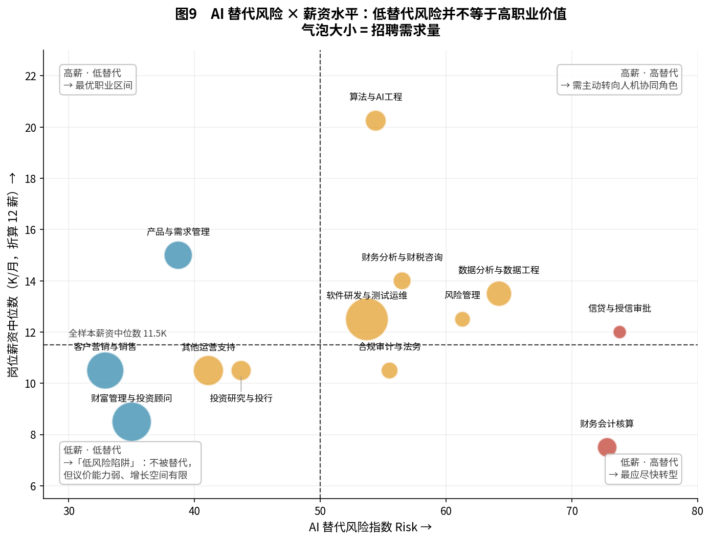

# 第四部分　人类与机器的协同思考
## ——基于 40 家上市公司 3254 条招聘岗位的 AI 替代风险量化研究

---

## 摘要

本部分复用第三部分抓取的结构化招聘数据（40 家 A 股金融/财务相关上市公司、3471 条原始岗位记录），经清洗后得到 3254 条有效岗位，建立了一套**可复现、可追溯、可检验**的金融财务岗位 AI 替代风险量化框架，并完成三项任务：

1. **AI 替代风险评估（问题 9）**：将 1315 个标准岗位名归并为 13 个岗位大类与 16 个典型金融职能岗，用五维加权模型给出 0–100 的量化风险评分。结果显示替代风险最高的是**信贷与授信审批（73.8）**与**财务会计核算（72.8）**，最低的是**客户营销与销售（32.9）**与**财富管理与投资顾问（35.0）**。
2. **人机协同模式设计（问题 10）**：选取信贷审批岗，拆解为 13 项可判定任务，设计了含置信度分流节点与贷后反馈闭环的 Human-in-the-Loop 工作流，并在给定的工时压缩情景假设下测算了协同前后的工时结构变化（执行类工作占比由 56% 降至 21%）。需要强调的是，**该测算是方案设计中的情景推演，而非从招聘数据中估计出的实证结果**。
3. **职业发展建议（问题 11）**：从数据反推出 5 条建议，每条均绑定具体统计证据，其中包括一个反直觉发现——**替代风险最低的岗位，薪资中位数也最低（8.5K vs 全样本 11.5K），因此"低 AI 替代压力"不能被直接等同于高职业价值。**

---

## 一、技术路线与代码结构

### 1.1 数据流

```
第三部分招聘数据 (company_jobs_merged.csv, 3471 条)
        ↓  模块 1：清洗 / 去重 / 岗位名标准化 / 分类
    3254 条 × 13 个岗位大类
        ↓  模块 2：五维证据特征抽取
    岗位级特征矩阵 + 大类级特征矩阵
        ↓  模块 3：数据证据分 × 专家先验分 融合 → 加权评分
    Risk Score + 三级风险分层 + 稳健性检验
        ↓  模块 4：可视化
    9 张图表（排名 / 矩阵 / 雷达 / 热力 / 证据 / 流程）
        ↓  模块 5：典型岗位任务拆解 + 协同流程 + 职业建议
    可执行的人机协同设计与 5 条数据驱动建议
```

### 1.2 代码模块

| 文件 | 职责 | 主要产出 |
|---|---|---|
| `config/taxonomy.py` | 分类体系、五维词典、专家先验、模型超参 | 全流程配置单一来源 |
| `01_job_classification.py` | 数据准备 + 岗位名标准化 + 岗位分类 | `01_*.csv`、分类日志 |
| `02_feature_engineering.py` | 五维证据特征抽取与聚合 | `02_*.csv`、词频表 |
| `03_risk_scoring.py` | 风险指标体系、评分、分层、敏感性分析 | `03_*.csv`、评分日志 |
| `04_visualization.py` | 风险结果可视化 | `fig1`–`fig6`、`fig9` |
| `05_human_ai_workflow.py` | 任务拆解与协同流程可视化 | `fig7`–`fig8`、任务表 |
| `05_human_ai_workflow.md` | 协同流程设计与职业建议正文 | 问题 10、11 的答案 |

所有中间产物均落盘为 CSV/JSON，可逐层核查，不存在"黑箱得分"。

---

## 二、数据准备与岗位分类（模块 1）

### 2.1 清洗口径与损耗

| 步骤 | 处理 | 剩余记录 |
|---|---|---|
| 原始数据 | 40 家上市公司 | 3471 |
| 去重复行 + 同一职位链接去重 | 平台重复挂出 | 3430 |
| 业务去重（同公司+同职位+同城市+同薪资） | 同岗多次发布 | 3344 |
| 剔除劳务派遣岗 | 派遣岗多为外包，会污染岗位画像 | **3254** |

薪资字段解析成功率 **99.91%**（`10-15K·13薪` 等格式统一折算为 12 薪等价月薪）。

### 2.2 岗位名称标准化

原始数据有 **2008 个不同职位名**，含大量职级前缀（高级/资深/储备）、招聘话术后缀（双休/五险一金/急招）、岗位编号（MJ002455）与地点括号。标准化规则：

- 去除括号补充说明、岗位编号、超长后缀；
- **前缀词只在词首剥离、后缀词只在词尾剥离**（这一约束是必要的：早期版本全局替换会把"金融实习生"误切为"金融生"）；
- 同义词归并（风险控制专员/风险管理专员 → 风控专员；理财顾问/财富顾问 → 理财经理等）。

结果：唯一职位名 **2008 → 1315**（收敛 34.5%）。映射表见 `data/01_title_normalize_map.csv`，可逐条抽查。

### 2.3 分类方法与结果

采用**有序规则词典命中 + 字符 n-gram TF-IDF 相似度兜底**的两级策略：

1. 优先用职位名匹配 12 类有序关键词（先命中先归类，配排除词避免"分析师"这类通用词误分）；
2. 职位名未命中时，用**高精度低召回**的 JD 专用词典在 JD 前 400 字内兜底（此处经过一次修正：初版直接用大类关键词扫 JD，导致"市场总监"因 JD 中出现一次"风险"被误归风险管理类，改为严格词典后消除）；
3. 仍未命中的长尾岗位，用字符级 TF-IDF 向量与各大类原型文本计算余弦相似度归类（无外网环境下作为 Embedding 的轻量替代），阈值 0.12 以下进入兜底类。

| 归类方式 | 记录数 | 占比 |
|---|---|---|
| 规则命中（职位名/JD） | 2891 | 88.8% |
| 相似度归类 | 73 | 2.2% |
| 兜底至"其他运营支持" | 290 | 8.9% |

**13 个岗位大类分布：**

| 岗位大类 | 岗位数 | 占比 | 公司数 |
|---|---|---|---|
| 软件研发与测试运维 | 966 | 29.7% | 28 |
| 财富管理与投资顾问 | 732 | 22.5% | 15 |
| 客户营销与销售 | 599 | 18.4% | 31 |
| 其他运营支持 | 290 | 8.9% | 35 |
| 产品与需求管理 | 230 | 7.1% | 28 |
| 数据分析与数据工程 | 154 | 4.7% | 22 |
| 算法与 AI 工程 | 72 | 2.2% | 19 |
| 投资研究与投行 | 63 | 1.9% | 15 |
| 财务会计核算 | 55 | 1.7% | 14 |
| 财务分析与财税咨询 | 37 | 1.1% | 3 |
| 合规审计与法务 | 28 | 0.9% | 13 |
| 风险管理 | 20 | 0.6% | 8 |
| 信贷与授信审批 | 8 | 0.2% | 5 |

> **这里必须指出一个重要的样本结构事实**：上市公司在公开招聘平台投放的岗位以**技术研发（29.7%）与前台营销（40.9%）** 为主，而中后台的信贷审批、风险管理、合规审计岗位样本极少。原因是这类岗位多通过内部选拔或校招定向渠道补员，很少公开社招。这一结构性偏差贯穿全部分析，第 6 节将说明本研究如何处理它。

---

## 三、岗位特征指标构建（模块 2）

### 3.1 五维指标的数据化设计

模型的核心要求是"不能五个分数全靠人工拍脑袋"。因此每个维度都建立了从招聘文本可直接统计的**证据代理变量**：

| 维度 | 含义 | 数据证据来源 |
|---|---|---|
| **R** 任务重复性 | 标准化循环任务占比 | JD 中重复性动作词覆盖率（录入/核对/台账/对账/月结…）+ 关键词强度 + 创造性词覆盖率（反向）+ 低门槛岗位占比 |
| **S** 规则化程度 | 任务可否被规则完整描述 | JD 中制度/流程/准则/监管/内控类词覆盖率 |
| **D** 任务数据数字化程度 | 处理对象是否已结构化 | **D_data = 数字化技能需求强度**：硬技能中 Python/SQL/Excel/数据库/BI/ERP 等出现比例 |
| **A** AI 技术成熟度 | AI 在该岗位任务上的可用度 | **A_data = AI 技能需求强度**（AI 技术渗透度）= 该类岗位中出现 AI 技术要求的岗位数 ÷ 该类岗位总数 |
| **H** 人类不可替代程度 | 人际/判断/责任承担的必要性 | 软技能中沟通/谈判/领导/协调/客户关系/决策等覆盖率 + 高经验壁垒占比 |

> **必须明确的口径区分（本研究方法论上最关键的一处澄清）**：
>
> 表中右列是**代理变量（proxy）**，不是维度本身。以 D 为例，招聘文本能观测到的只是"这个岗位是否要求求职者会 Python/SQL/BI"，即 **D_data = 数字化技能需求强度**；而模型真正要度量的 D 是"**该岗位处理的业务对象是否已经是结构化电子数据**"。两者相关但不等价：银行柜面岗几乎不要求 Python/SQL（故 D_data 很低，仅 26.9），但其业务流程实际上高度数字化。同理，**JD 中出现 AI 技能要求 ≠ 该岗位已容易被 AI 自动化**——算法岗要求 AI 技能，恰恰因为它是 AI 的生产者而非被替代者。
>
> 本研究通过两个机制处理这一偏差：一是**专家先验**直接对维度本身（而非代理变量）打分；二是**样本量收缩**限制代理变量的话语权。因此最终融合分 D、A 应读作"任务数据数字化程度""AI 技术成熟度"，而 D_data、A_data 仅作为其可核查的招聘侧证据。

### 3.2 全样本证据统计

| 指标 | 全样本占比 |
|---|---|
| 提出 AI 技术要求的岗位 | **14.5%** |
| 提出数字化硬技能要求的岗位 | **39.4%** |
| 提出高阶人际软技能要求的岗位 | **74.1%** |

高频关键词（`data/02_skill_frequency.csv`）：

- **AI 技术栈**：AI(9.6%)、大数据(5.4%)、大模型(3.3%)、Agent(2.8%)、人工智能(1.9%)、智能体(1.8%)、LLM(1.2%)、Prompt(1.0%)
- **数字化硬技能**：SQL(24.9%)、MySQL(19.2%)、数据库(18.8%)、Oracle(13.6%)、Linux(8.9%)、Python(8.3%)
- **人际软技能**：沟通(51.7%)、培训(18.8%)、责任心(17.1%)、协调(16.4%)、拓展(15.9%)、表达(13.0%)

> 值得注意的是：**大模型、Agent、Prompt 这类 2023 年后才出现的词，已经在 3.3%、2.8%、1.0% 的岗位中被明确写入招聘要求**，表明大模型相关技术已开始进入上市公司的招聘技能体系。
>
> （口径提示：以上为**全样本占比**，只能说明这些技术词已进入招聘语料，尚不足以证明其已"从算法岗外溢到业务岗"。要支持后一判断，需进一步比较业务岗与算法/技术岗内部的出现率差异，本研究未做该项检验，故不作此推断。）

### 3.3 组内相对标定

原始覆盖率天然偏低（例如仅 8.3% 的岗位明确要求 Python），直接乘 100 会让所有维度挤在低分区、丧失区分度。因此对每个维度做 **min-max 相对标定至 [10, 90]**。

这一处理的合理性在于：**替代风险本身只在岗位之间横向可比**——说"会计岗重复性 88 分"没有绝对意义，说"会计岗重复性在 13 类岗位中最高"才有意义。

---

## 四、AI 替代风险评分（模块 3）

### 4.1 评分模型

$$Risk_j = 0.25 R_j + 0.20 S_j + 0.20 D_j + 0.20 A_j + 0.15(100 - H_j)$$

$$Risk \in [0, 100]，分层：70\text{–}100\ 高替代风险 \quad 40\text{–}69\ 中等替代风险 \quad 0\text{–}39\ 低替代风险$$

其中每个维度分由**数据证据分**与**专家先验分**融合而成：

$$X_j = w_{data}(n_j) \cdot X_j^{data} + (1 - w_{data}(n_j)) \cdot X_j^{expert}$$

### 4.2 关键方法设计：样本量收缩（Shrinkage）

$$w_{data}(n) = w_{base} \cdot \frac{n}{n + K}, \quad K = 30$$

这是本研究针对第 2.3 节所述样本结构偏差做的核心方法论处理。**岗位样本越少，其文本证据越不稳定，数据权重就越向专家先验收缩。**

举例：信贷与授信审批仅 8 条样本，其数据权重被压缩至基准的 21%；而财富管理有 732 条样本，数据权重达到基准的 96%。这样既避免了"8 条样本决定一个大类的命运"，也避免了大样本类别被专家主观判断覆盖。

各维度基准权重（`config/taxonomy.py`）：D、A、H 三维数据证据直接来自技能字段，基准 0.60；R、S 两维文本代理较弱，基准 0.40。

专家先验的每一条都附有书面理由（`data/03_risk_scores_category.csv` 的"专家先验依据"列），例如：

> 财务会计核算：凭证—账簿—报表链条高度标准化，会计准则即规则，数据早已电子化，OCR+RPA+规则引擎已工程化落地。
> 财富管理与投资顾问：资产配置建议可由智能投顾产出，但客户信任、情绪安抚与合规适当性沟通高度依赖人。

### 4.3 主结果：13 个岗位大类的风险评分



| 排名 | 岗位大类 | R | S | D | A | H | **Risk** | 风险等级 |
|---|---|---|---|---|---|---|---|---|
| 1 | 信贷与授信审批 | 75.3 | 82.1 | 76.0 | 71.2 | 39.0 | **73.8** | 高替代风险 |
| 2 | 财务会计核算 | 88.5 | 76.2 | 64.2 | 55.9 | 24.0 | **72.8** | 高替代风险 |
| 3 | 数据分析与数据工程 | 51.3 | 51.2 | 92.5 | 63.7 | 34.3 | 64.2 | 中等 |
| 4 | 风险管理 | 55.6 | 74.9 | 69.8 | 60.5 | 57.3 | 61.3 | 中等 |
| 5 | 财务分析与财税咨询 | 58.5 | 70.0 | 59.3 | 51.5 | 61.9 | 56.5 | 中等 |
| 6 | 合规审计与法务 | 54.2 | 75.4 | 57.8 | 49.8 | 64.2 | 55.5 | 中等 |
| 7 | 算法与 AI 工程 | 34.0 | 43.3 | 80.3 | 71.6 | 54.5 | 54.4 | 中等 |
| 8 | 软件研发与测试运维 | 37.5 | 43.0 | 78.2 | 43.7 | 24.6 | 53.7 | 中等 |
| 9 | 投资研究与投行 | 39.9 | 39.2 | 54.7 | 41.3 | 55.5 | 43.7 | 中等 |
| 10 | 其他运营支持 | 49.7 | 44.0 | 33.1 | 27.4 | 48.2 | 41.1 | 中等 |
| 11 | 产品与需求管理 | 31.1 | 40.7 | 54.9 | 39.2 | 73.8 | 38.7 | 低替代风险 |
| 12 | 财富管理与投资顾问 | 38.6 | 31.6 | 29.1 | 27.9 | 48.9 | 35.0 | 低替代风险 |
| 13 | 客户营销与销售 | 45.6 | 32.3 | 27.3 | 26.6 | 71.5 | **32.9** | 低替代风险 |

### 4.4 细分结果：16 个典型金融职能岗排名（问题 9 的直接答案）

由于金融核心大类内部的职位名过于稀疏（信贷类 8 条样本无一重名），直接按职位名做细分排名会失真。因此改用**任务导向的职能岗口径**：用职位名正则跨大类抽取同一类工作任务的岗位，覆盖 1225 条岗位（占全样本 37.6%）。另有 2 个预设职能岗因样本量不足 5 被剔除（财务分析与预算管理 n=2、反欺诈与反洗钱 n=0），剔除记录见 `data/03_roles_dropped.csv`。

抽取过程中执行了两次重要的口径净化：
- 排除**技术实现岗**（如"Java 开发工程师（金融信贷）"——任务结构属研发而非信贷）；
- 排除**纯营销岗**（如"信用卡客户经理"——任务结构属销售而非审批）。修正前信贷类匹配到 53 条，修正后仅 12 条。



| 排名 | 典型职能岗 | 岗位数 | R | S | D | A | H | **Risk** | 等级 | 证据强度 |
|---|---|---|---|---|---|---|---|---|---|---|
| 1 | 资产盘点与台账管理 | 10 | 93.3 | 77.2 | 65.0 | 55.9 | 28.4 | **73.7** | 高 | 弱※ |
| 2 | 清结算与账户操作 | 7 | 90.4 | 76.7 | 62.0 | 55.9 | 21.1 | **73.3** | 高 | 弱※ |
| 3 | 信贷审批与贷后管理 | 12 | 74.1 | 78.2 | 71.5 | 71.2 | 38.4 | **71.9** | 高 | 弱※ |
| 4 | 会计核算与记账 | 25 | 86.1 | 73.4 | 61.1 | 55.9 | 18.5 | **71.8** | 高 | 中 |
| 5 | 风控策略与风险监控 | 11 | 53.0 | 73.1 | 69.5 | 61.1 | 56.2 | 60.6 | 中 | 弱※ |
| 6 | 合规内控与审计 | 10 | 54.0 | 80.4 | 59.4 | 50.6 | 64.7 | 56.9 | 中 | 弱※ |
| 7 | 财税咨询顾问 | 32 | 58.7 | 70.4 | 59.1 | 51.5 | 61.8 | 56.6 | 中 | 中 |
| 8 | 法务与法律事务 | 5 | 50.6 | 76.7 | 55.3 | 48.6 | 64.6 | 54.1 | 中 | 弱※ |
| 9 | 证券分析与投资研究 | 22 | 41.5 | 38.8 | 55.8 | 42.2 | 55.2 | 44.5 | 中 | 中 |
| 10 | 投行承做与承销 | 25 | 37.9 | 39.3 | 53.5 | 40.3 | 54.3 | 42.9 | 中 | 中 |
| 11 | 投资顾问 | 187 | 38.3 | 33.6 | 29.2 | 27.8 | 50.5 | 35.1 | 低 | 强 |
| 12 | 理财与财富管理 | 526 | 38.8 | 30.6 | 29.0 | 27.9 | 48.3 | 35.0 | 低 | 强 |
| 13 | 柜面与网点运营 | 35 | 46.9 | 33.6 | 26.9 | 25.5 | 67.4 | 33.8 | 低 | 中 |
| 14 | 客户经理与客户维护 | 205 | 48.4 | 31.2 | 28.4 | 27.1 | 72.2 | 33.6 | 低 | 强 |
| 15 | 电话销售与客服 | 23 | 49.5 | 33.0 | 25.7 | 25.7 | 74.0 | 33.1 | 低 | 中 |
| 16 | 证券经纪与拓客 | 90 | 40.0 | 29.5 | 25.1 | 25.3 | 67.4 | **30.9** | 低 | 强 |

※ 证据强度"弱"表示样本量 < 20，评分以专家先验为主（图 1 中以斜纹标注）。

**对问题 9 的回答：**

> 模型识别出的**高替代压力任务主要集中于资产盘点与台账管理（73.7）、清结算与账户操作（73.3）、信贷审批与贷后管理（71.9）与会计核算与记账（71.8）**，四者均落在高替代风险区间。它们的共同结构是：**任务重复性极高（R 74–93）、规则化程度高（S 73–78）、处理对象已完全数字化（D 61–72），而人类不可替代性极低（H 18–38）**。
>
> **但前三类的公开招聘样本量均不足 20 条（n = 10、7、12），其得分以专家先验为主，具体名次应谨慎解释；相比之下会计核算与记账（n = 25）的样本支持相对更充分。** 因此本研究的稳健结论是"这一组任务整体处于高替代压力区间"，而非"资产盘点就是最容易被 AI 替代的岗位"这一具体排序。
>
> **最难被 AI 替代的岗位**是证券经纪与拓客（30.9）、电话销售与客服（33.1）、客户经理与客户维护（33.6）、柜面与网点运营（33.8）。其共同结构是：**人类不可替代性高（H 67–74）、数据数字化与 AI 渗透度都很低（D、A 均在 25–29）**。这类岗位的护城河不是技术壁垒，而是**人际信任与责任承担**。
>
> 中间地带的风控（60.6）、合规审计（56.9）、财税咨询（56.6）、投研（44.5）则是典型的**"任务分化型"岗位**——底层的数据整理、指标计算、条文比对会被替代，上层的判断、解释与问责不会。

### 4.5 二维矩阵与四象限定位



以 AI 替代风险为横轴、人类不可替代性为纵轴，16 个职能岗形成四个象限：

- **Ⅳ 高危区（低不可替代 · 高替代压力）**：会计核算、清结算、资产盘点、信贷审批 —— 转型最紧迫；
- **Ⅰ 人机协同区（高不可替代 · 高替代压力）**：风控、合规审计、财税咨询、法务 —— 需要任务重构，让 AI 做前段、人做判断；
- **Ⅱ 安全区（高不可替代 · 低替代压力）**：客户经理、经纪人、电话客服、柜面 —— 岗位稳固，但需补数字化能力；
- **Ⅲ 观望区**：本次样本中无岗位落入，说明公开招聘的金融岗位都至少具备一定的人际或技术价值。

### 4.6 五维画像与证据链



雷达图揭示了单一 Risk 分数掩盖的结构差异：会计核算是"重复性驱动型"高风险（R 86 但 A 仅 56），信贷审批是"全维度均衡型"高风险（五维中四维均 > 70），而客户经理呈现明显的"H 独高"形态。**这意味着应对策略不能一刀切**——会计岗的出路是升级任务层次，客户经理的出路是补技术短板。





图 5 是本研究的**可追溯性检验**：每个维度都并列显示数据证据分（绿）、专家先验分（紫）与最终融合分（红菱形）。可以直观看到，大样本类别（财富管理、客户营销）的融合分紧贴数据分，小样本类别（信贷审批、风险管理）的融合分明显偏向专家分——这正是样本量收缩机制在起作用。

### 4.7 稳健性检验

对基准排名做了 8 组情景检验（`data/03_sensitivity.csv`）：

| 情景 | 与基准排名 Spearman 相关 | 最高风险岗位 | 最低风险岗位 |
|---|---|---|---|
| R 权重 +0.05 | 1.0000 | 信贷与授信审批 | 客户营销与销售 |
| S 权重 +0.05 | 1.0000 | 信贷与授信审批 | 客户营销与销售 |
| D 权重 +0.05 | 0.9945 | 信贷与授信审批 | 客户营销与销售 |
| A 权重 +0.05 | 0.9945 | 信贷与授信审批 | 客户营销与销售 |
| H 权重 +0.05 | 0.9835 | 信贷与授信审批 | 客户营销与销售 |
| 五维等权（各 0.20） | 0.9615 | 信贷与授信审批 | 客户营销与销售 |
| 纯专家先验 | 0.9725 | 财务会计核算 | 客户营销与销售 |
| 纯数据证据 | 0.7747 | 数据分析与数据工程 | 客户营销与销售 |

**结论**：
1. **五维权重做小幅调整时，岗位排序基本不变**（ρ ≥ 0.98），说明结论不依赖于特定权重取值。这是本节最主要的结论。
2. 融合结果与专家先验的排序高度一致（ρ = 0.97），同时招聘数据对部分岗位的相对位置做了修正（如财务会计核算与信贷审批的首位次序发生互换）。
   > 需要说明：融合模型本身已包含专家先验，因此这一高相关**不构成对先验的独立验证**，只能说明在当前样本量下，数据证据未对先验形成实质性推翻。
3. **纯数据证据的相关性明显下降（ρ = 0.77），且最高风险岗位变为"数据分析与数据工程"**——这恰恰暴露了纯文本统计的局限：数据岗因为 JD 里密集出现 Python/SQL 而被判高分，但这些技能是它的**生产工具**而非**被替代的证据**。这也再次印证了第 3.1 节关于代理变量与维度本身不等价的判断，是必须引入专家先验的直接原因。

**补充探索性分析（非交叉验证证据）**：另用 KMeans 对五维做了独立聚类，与阈值分层的一致率为 **61.5%**。这属于中等一致水平，**不足以作为分层结果的强验证**，此处仅作为探索性参考。差异集中在中风险带：聚类把风险管理、财务分析、合规审计归入"高替代"簇（因其五维形态接近高风险组），而阈值法因综合分未达 70 判为中等。这一分歧提示这三类岗位可能处在风险跃迁的边缘，值得后续用更充分的样本进一步考察。

---

## 五、人机协同模式设计（问题 10）

完整设计见 **`05_human_ai_workflow.md`**，此处摘要核心结论。

选取**信贷审批与贷后管理**岗（Risk 71.9，二维矩阵 Ⅳ 高危区）作为设计对象，理由是它同时具备高规则化、高数字化、低人类不可替代性，但决策后果具有**法律责任**——天然要求"AI 做多、人担责"的结构。

### 5.1 任务拆解



将岗位拆为 13 项任务，逐项评估重复性、规则化、数字化与 AI 可承担度：

- **AI 可主导 7 项**，占原工时 **56%**（资料归档、OCR 提取、征信解析、反欺诈筛查、指标计算、评分卡打分、贷后监测）；
- **人机协同 3 项**，占 28%（经营真实性验证、风险摘要生成、额度定价设计）；
- **人类主导 3 项**，占 16%（异常非标判断、最终审批签字、逾期沟通谈判）——三者 AI 可承担度均 ≤ 25。

**在假设 AI 主导任务的人工工时压缩至原来的 15%、人机协同任务压缩至 55%、人类主导任务全部保留的情景下**，人工工时结构由 `56 : 28 : 16` 重构为约 **`21 : 39 : 40`**。

> ⚠️ **参数性质声明**：`21 : 39 : 40` 是**基于上述压缩率假设的情景推演结果，不是从招聘数据中估计出的实证结论**。压缩率（15% / 55% / 100%）由研究者依据任务的 AI 可承担度设定，用于说明协同方案的方向性影响；其绝对数值不应被解读为对任何具体机构的预测。同样，下文协同方案中的 **70% / 30% 标准件分流比例、OCR 置信度阈值 0.95、PD 灰区 2%–15%、自动通过件人工抽查率 ≥10%**，均为**方案设计中的示例性参数（情景参数）**，需要在实际落地时用机构自有的历史审批数据回测标定，本研究并未对其做实证估计。

在这一情景下可以看到的方向性结论是：**AI 不消灭岗位，而是把执行岗改造为判断岗**——工时占比上升最快的是协同类与人类主导类工作。

### 5.2 协同工作流



工作流由三部分构成：

1. **AI 前段链路**：OCR/NLP 抽取 → 特征工程 → 机器学习评分（PD）→ LLM 生成风险摘要（强制逐条附数据出处）；
2. **置信度分流节点**：三条硬规则同时成立才走自动通道——关键字段置信度 ≥ 0.95、PD 落在明确区间（灰区 2%–15% 一律转人工）、未命中红线规则。约 70% 标准件走 AI 建议 + 人工抽检（≥10%），30% 非标件走人工重点复核。**（以上数值均为示例性情景参数，见 5.1 节参数性质声明）**；
3. **反馈闭环**：贷后表现回流 → 模型监控与再训练（PSI 漂移检测）→ 阈值调优（人类设定风险偏好）→ 可解释性与合规审计（SHAP 归因、全链路留痕）。

设计中特别强调：**人工否决 AI 建议时必须填写理由**。这些样本既是合规证据，也是模型最有价值的负例训练数据——它把"人纠正 AI"从一次性动作变成可积累的组织资产，这是"协同"区别于"AI 全自动 + 人兜底"的本质。

---

## 六、职业发展建议（问题 11）

完整论证见 `05_human_ai_workflow.md` 第四节，此处列出 5 条建议及其数据依据：

| # | 建议 | 核心数据依据 |
|---|---|---|
| 1 | **优先把数字化工具能力补到及格线**（SQL + Excel/BI + Python 基础） | 全样本数字化技能覆盖率 39.4%，但招聘量最大的财富管理 + 客户营销两类（占 40.9%）仅 **4.1%** —— 金融生最易进入的岗位恰恰数字化训练最少 |
| 2 | **警惕「低替代风险陷阱」** | 风险最低的财富管理类薪资中位数仅 **8.5K**，低于全样本 **11.5K**；而 Risk 中等的算法岗达 20.25K。**低 AI 替代压力不能被直接等同为高职业价值**，职业选择还需同时考虑薪资、技能壁垒与成长空间 |
| 3 | **把目标定位在「协同层」而非执行层或纯技术层** | 任务拆解显示，AI 可承担度低的任务集中在判断与担责环节；在 5.1 节的工时压缩情景下，占比上升最快的是协同类与人类主导类工作。全样本仅 14.5% 岗位要求 AI 技术，金融专业者的优势在于**使用模型输出并对其负责** |
| 4 | **刻意训练「AI 结果验证能力」** | 人类保留的三项主导任务 AI 可承担度均 ≤ 25，共同特征是责任承担与不完整信息下的判断；能稳定发现模型幻觉的人本身构成一道风控防线 |
| 5 | **用「任务组合」而非「岗位名称」规划路径** | 同为"分析师"，做数据整理（AI 可承担度 92）与做投资判断（25）风险截然不同；应定期盘点"每天有几小时在做 AI 可承担度 90 以上的事" |



图 9 是建议二的核心证据。左下象限的"低薪 · 低替代"区间（财富管理、客户营销）聚集了本次样本 **40.9%** 的招聘需求——**这是金融专业毕业生最可能落入的位置，也是本研究最需要提醒的风险**。

数据能够直接支持的事实是：**AI 替代风险与薪资中位数之间不存在负相关，替代风险最低的两类岗位薪资中位数反而低于全样本中位数。** 一种可能的解释是，这类岗位虽因高度依赖人际互动而具有较低的 AI 替代压力，但岗位供给规模、技能稀缺性与业务模式等因素仍可能限制其薪资水平；本研究的数据不足以直接检验这一机制，故仅作为待验证的解释提出。

由此得到的稳健推论是：**低 AI 替代压力不能被直接等同为高职业价值，职业选择还需要同时考虑薪资、技能壁垒和成长空间。** 相对稳固的位置在左上象限（高薪 + 低替代），如产品与需求管理类（15.0K，Risk 38.7）。

---

## 七、研究局限与改进方向

本研究刻意把局限写在正文，而非回避：

1. **样本结构偏差是最大局限。** 上市公司公开招聘以技术研发（29.7%）与前台营销（40.9%）为主，中后台的信贷审批（8 条）、风险管理（20 条）、合规审计（28 条）样本极少。更严重的是，**即便在 12 条"信贷"岗位中，真正的授信审批岗也几乎不存在**——公开招聘的信贷类岗位主要是信用卡营销、驻点发卡与逾期催收。这意味着这些大类的风险评分主要由专家先验驱动，**应作为定性判断的量化表达来理解，而非严格的统计推断结论**。研究中已通过样本量收缩机制与"证据强度"标注（图 1 斜纹）对此保持透明。改进方向：补充招聘平台之外的数据源（企业年报的人员结构披露、行业岗位说明书、专业资格考试大纲）。

2. **关键词匹配无法理解语义。** "沟通"出现在 51.7% 的 JD 中，很多只是模板话术而非真实能力要求；反之，真正需要复杂判断的任务未必会写在 JD 里。改进方向：引入中文预训练语义模型对 JD 做句级任务抽取，而非词级匹配。

3. **专家先验的主观性。** 尽管每条先验都附有书面理由且经过敏感性检验，但它仍然是研究者的判断。改进方向：采用德尔菲法收集多位从业者的独立打分，用组间一致性（如 Kendall's W）检验先验的可靠性。

4. **风险评分反映的是"技术可行性"而非"实际替代速度"。** 实际替代还受制于监管要求、组织惯性、改造成本与劳动法约束。例如信贷审批的技术可替代性很高，但监管对信贷决策的问责要求会长期保留人工签字环节。本研究的评分应理解为**替代压力的排序**，而非替代时间表。

5. **静态截面数据。** 本次数据为单一时点抓取，无法观察岗位需求与技能要求的时间趋势。若能获取多期数据，可以观察 AI 技术栈关键词的渗透速度，这比静态占比更有预测价值。

---

## 八、交付清单

```
task4/
├── README.md                            复现说明（环境、数据、运行顺序）
├── requirements.txt                     依赖版本
├── Part4_Report.md                      本报告
├── 05_human_ai_workflow.md              协同流程与职业建议（问题 10、11）
├── raw_data/
│   └── company_jobs_merged.csv          第三部分产出的原始招聘数据（运行前放入）
├── config/
│   ├── __init__.py
│   └── taxonomy.py                      分类体系 / 词典 / 专家先验 / 超参
├── 01_job_classification.py             模块 1：清洗、标准化、分类
├── 02_feature_engineering.py            模块 2：五维证据特征
├── 03_risk_scoring.py                   模块 3：风险评分与检验
├── 04_visualization.py                  模块 4：风险可视化
├── 05_human_ai_workflow.py              模块 5：任务拆解与流程图
├── data/
│   ├── 01_jobs_classified.csv           3254 条岗位 + 标准名 + 大类
│   ├── 01_title_normalize_map.csv       职位名标准化映射（可抽查）
│   ├── 01_category_summary.csv          大类规模统计
│   ├── 01_classification_log.json       清洗与分类过程日志
│   ├── 02_job_level_features.csv        岗位级五维证据（含命中关键词）
│   ├── 02_category_feature_matrix.csv   大类级特征矩阵
│   ├── 02_skill_frequency.csv           三类技能词频
│   ├── 02_feature_log.json              特征构建日志
│   ├── 03_risk_scores_category.csv      13 大类风险总表
│   ├── 03_risk_scores_typical_roles.csv 16 典型职能岗风险表
│   ├── 03_risk_scores_subjob.csv        71 个细分职位名风险表
│   ├── 03_dimension_detail.csv          五维数据分/先验分/融合分对照
│   ├── 03_sensitivity.csv               8 组稳健性检验
│   ├── 03_cluster_assignment.csv        KMeans 聚类分层
│   ├── 03_roles_dropped.csv             样本不足被剔除的职能岗
│   ├── 03_scoring_log.json              评分过程日志
│   └── 05_task_decomposition.csv        信贷审批岗 13 项任务拆解
└── figures/
    ├── fig1_risk_ranking.png            典型职能岗风险排名
    ├── fig2_risk_matrix.png             风险 × 人类不可替代性二维矩阵
    ├── fig3_radar.png                   代表岗位五维雷达
    ├── fig4_heatmap.png                 13 类岗位五维热力图
    ├── fig5_data_vs_expert.png          数据分 vs 专家分对照
    ├── fig6_evidence.png                三类技能覆盖率原始证据
    ├── fig7_workflow.png                人机协同工作流
    ├── fig8_task_boundary.png           任务级职责边界与工时重构
    └── fig9_risk_vs_salary.png          风险 × 薪资：低风险陷阱
```

**复现方式**：

```bash
pip install -r requirements.txt
# 将第三部分产出的 company_jobs_merged.csv 放入 raw_data/
cd task4
python 01_job_classification.py     # -> data/01_*.csv
python 02_feature_engineering.py    # -> data/02_*.csv
python 03_risk_scoring.py           # -> data/03_*.csv
python 04_visualization.py          # -> figures/fig1–fig6, fig9
python 05_human_ai_workflow.py      # -> figures/fig7–fig8, data/05_*.csv
```

脚本以 `Path(__file__).parent` 为基准解析所有路径，**不含任何绝对路径**；原始数据位置亦可通过环境变量 `JOBS_RAW_CSV` 覆盖。`data/` 与 `figures/` 目录会在运行时自动创建，因此可从空目录（仅保留脚本、`config/`、`raw_data/`）完整重建全部中间产物与 9 张图表。
